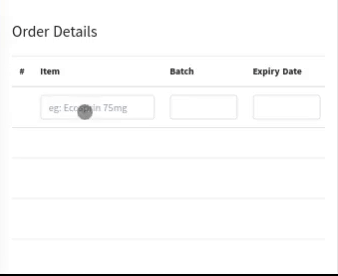

### vue-autocomplete

The `vue-autocomplete` component offers simple and flexible type-ahead functionality. This is useful when searching large sets of data or even dynamically requesting information from an API.



### Props

| Props         | Description                                                                                  | Type           |
| ------------- | -------------------------------------------------------------------------------------------- | -------------- |
| `id`          | Specifies a unique id for an HTML element.                                                   | **String**     |
| `placeholder` | A short hint that describes the expected value of input field.                               | **String**     |
| `api`         | GET List of items, optionally using pagination, sorting and filtering to navigate big lists. | **URI**        |
| `attr`        | An Object Key, representing the "rendered" text content of a dropdown-list element           | **Object Key** |
| `value`       | An Object Key, specifies the return _string_ value of the list element on selection.         | **Object Key** |
| `reset`       | A true/false toggle to force reset/empty the input field.                                    | **Boolean**    |
| `text`        | A String to force set the value of input field.                                              | **String**     |

### Events

| Events     | Description                                             |
| ---------- | ------------------------------------------------------- |
| `tab`      | Fired on **Tab** key Press & on selections.             |
| `selected` | Fired on Selection and returns entire selected object.  |
| `newVal`   | Fired when input changes with the updated string value. |

### Instructions

Use GET requests to retrieve resource representation/information.
**URI Must end with a query parameter name & equal sign**

##### Example request URIs:

1. http://example.org/users?q=
1. http://example.org/users?size=20&page=5&q=

##### Example Response

```javascript
[
    {
        "name": "Edward F Woods"
        "address":"2356 Philadelphia Avenue",
        "phoneNumber":"801-261-4941"
    },
    {
        "name":"Stephen F Houser",
        "address":"896 Cedarstone Drive",
        "phoneNumber":"419-491-9630"
    }
]
```

##### Implementation

```html
<template>
    <div>
        <AutoComplete
            id="search"
            placeholder="Eg: Ecosprin 75mg"
            attr="name"
            value="name"
            api="/users?q="
            @tab="$refs.age.focus()"
            @selected="selectUser"
            @newVal="
                val => {
                    person.name = val;
                }
            "
        />

        <!--Some other fields -->

        <input type="number" ref="age" />
    </div>
</template>
/>
```

```javascript
import AutoComplete from "AutoComplete";

export default {
    data() {
        return {
            person: {
                name: "",
                address: "",
                phoneNumber: "",
            },
        };
    },

    methods: {
        selectUser(user) {
            this.person.address = user.address;
            this.person.phoneNumber = user.phoneNumber;
        },
    },

    components: {
        AutoComplete,
    },
};
```

#### CSS

Stylings uses **Bootstrap CSS** by default.
**Example:**
|Class|Description|
|-|-|
|`.active`|Adds a blue background color to the active dropdown item in a dropdown.|
